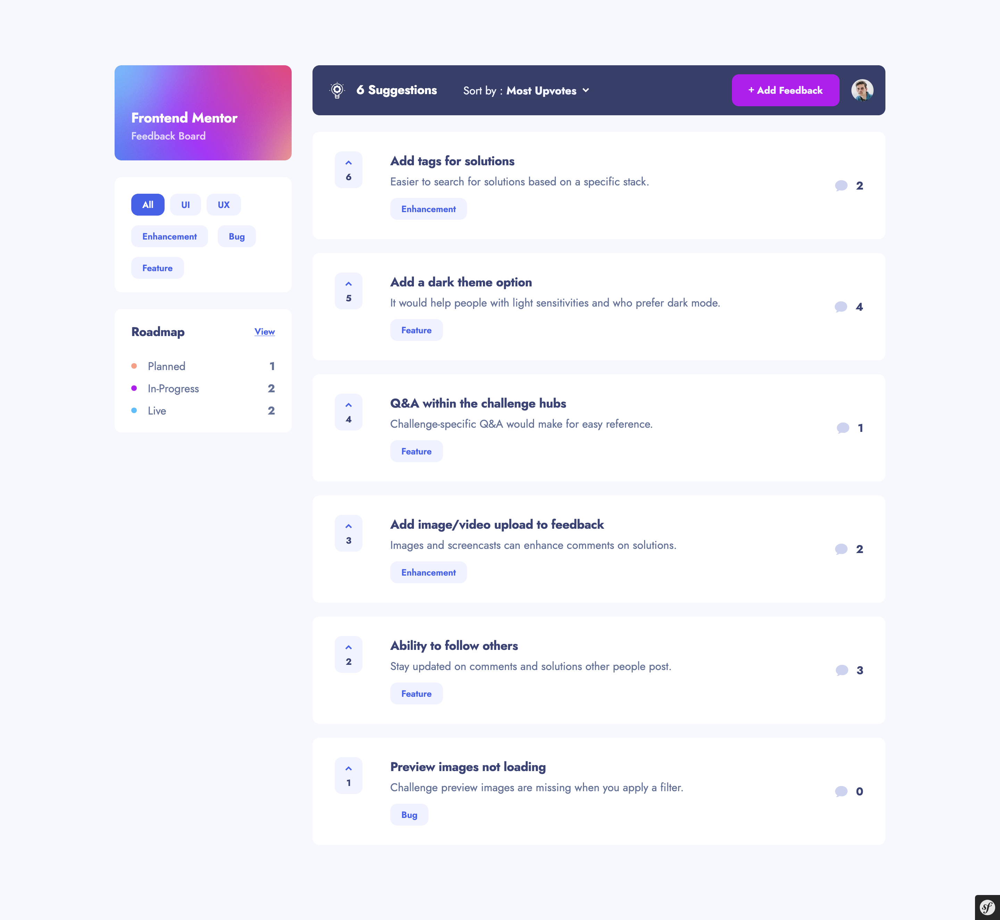
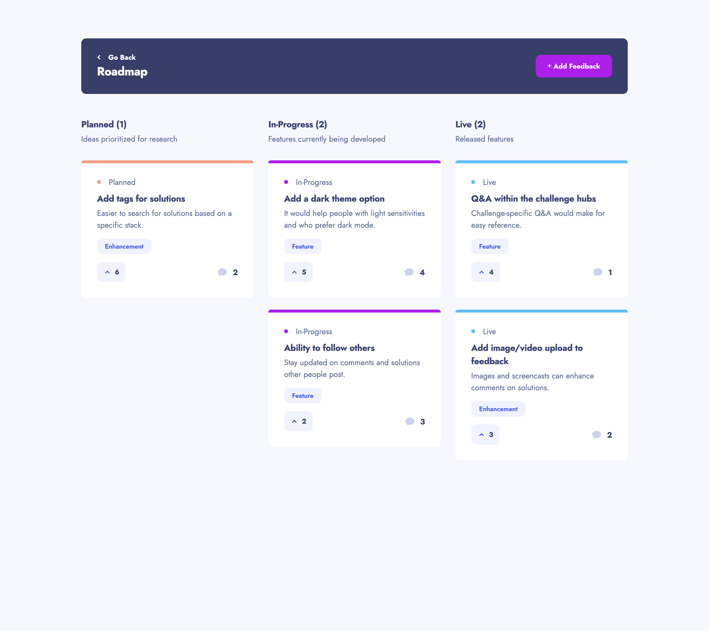
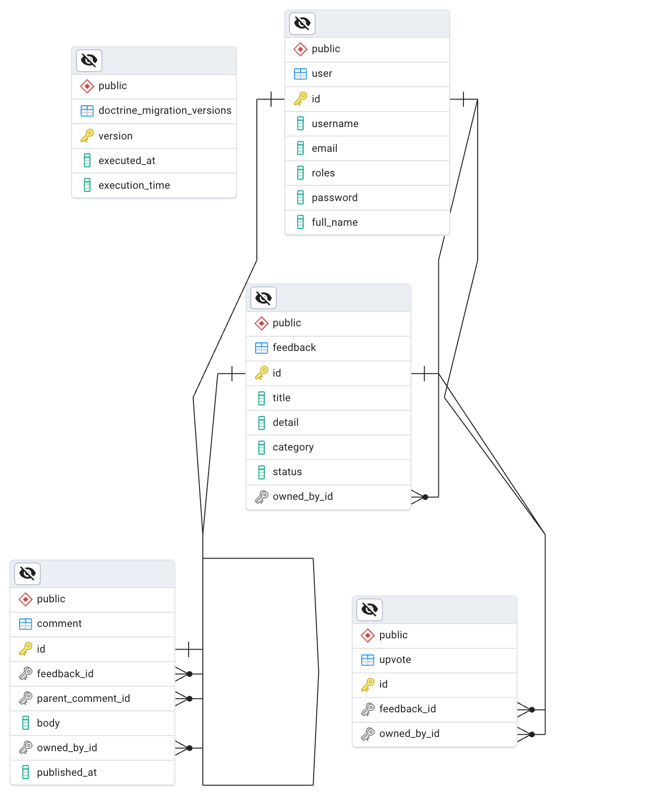

# Product Feedback App

A full-stack application for managing and tracking product feedback requests.

## Table of contents

- [Overview](#overview)
  - [The challenge](#the-challenge)
  - [Screenshot](#screenshot)
  - [Links](#links)
- [My process](#my-process)
  - [Built with](#built-with)
- [Usage](#usage)
  - [Test user accounts](#test-user-accounts)
  - [Development](#development)
- [Acknowledgments](#acknowledgments)

## Overview

### The challenge

Users should be able to:

- View the optimal layout for the app depending on their device's screen size
- See hover states for all interactive elements on the page
- Create, read, update, and delete product feedback requests
- Receive form validations when trying to create/edit feedback requests
- Sort suggestions by most/least upvotes and most/least comments
- Filter suggestions by category
- Add comments and replies to a product feedback request
- Upvote product feedback requests
- Keep track of any changes, even after refreshing the browser.

### Screenshot




### Links

- [Solution](https://github.com/grenzk/product-feedback-app)
- [Live Site](https://product-feedback-app-rcnw.onrender.com)

## My process

### Built with

#### Frontend

- Semantic HTML5 markup
- CSS custom properties
- Flexbox
- CSS Grid
- Mobile-first workflow
- SASS
- Vue
- Vue Router
- PrimeVue (Vue component library)
- Fetch API (HTTP requests and data handling)
- Pinia (State management)
- VeeValidate with Yup (Form validation stack)

#### Backend

- Symfony
- PostgreSQL

#### ERD



## Usage

### Test user accounts

|             Email              | Password  |
| :----------------------------: | :-------: |
| `george.partridge@example.com` | foobar123 |
|   `elijah.moss@example.com`    | foobar123 |
|  `james.skinner@example.com`   | foobar123 |
|  `anne.valentine@example.com`  | foobar123 |

### Development

To run the project locally, follow these steps:

1. Clone the repository and navigate to the project directory:

```bash
git clone git@github.com:grenzk/product-feedback-app.git
cd product-feedback-app
```

2. Run the following commands to install the project dependencies:

```bash
npm install
composer install
```

3. Run the following command to start the development server:

```bash
scripts/run.sh start
```

**Note:** The `scripts/run.sh` file is a convenience script that simplifies the process of setting up the development environment. It assumes that you have **Docker** and **Docker Compose** installed on your system.

4. Run the following command to create the database schema and load all sample data:

```bash
bin/console doctrine:database:create
bin/console doctrine:migrations:migrate
bin/console doctrine:fixtures:load
```

5. Open your web browser and navigate to `https://127.0.0.1:8000` to access the application.

## Acknowledgments

This project was inspired by the [Product feedback app challenge on Frontend Mentor](https://www.frontendmentor.io/challenges/product-feedback-app-wbvUYqjR6). Frontend Mentor challenges provide valuable opportunities to enhance coding skills by working on realistic projects.
